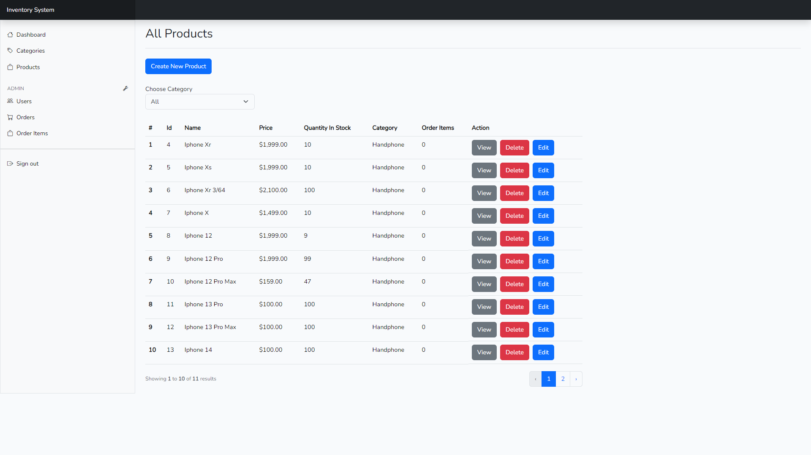
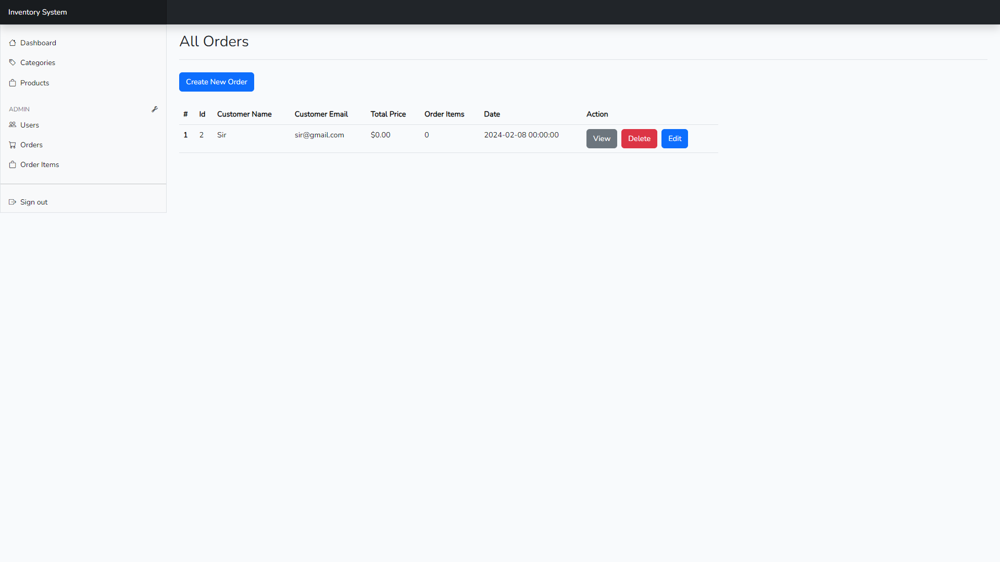

# Laravel Inventory System with Bootstrap and MySQL Database

This is a web based application from RestfulAPI Inventory System project, you can visit the project on  https://github.com/mantokreng/Restful-API-Inventory-System-Laravel

## Screenshot

## Key Features

- Roles System
- Categories
- Products
- Orders
- Order Items
- Users
- Crud
- Responsive Web
- Synchronous Data Between Orders, Order Items and Products
- MYSQL
- Blade Template
- Unit Testing
- Authentication
- Authorization
- Route Management
- Pagination
- Eloquent

